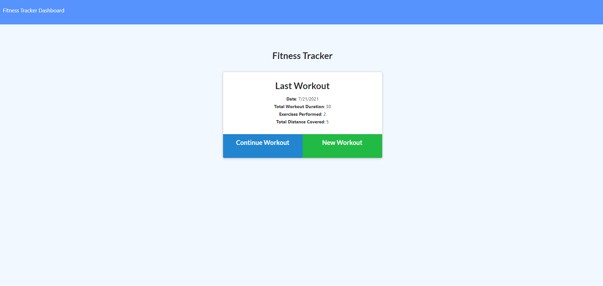
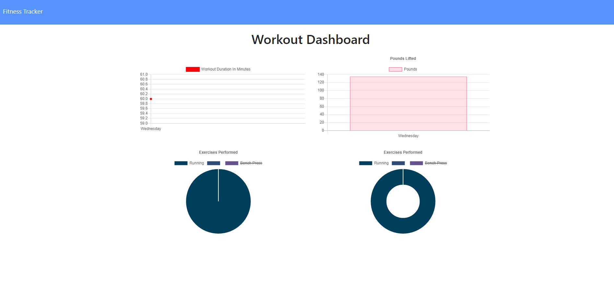

# Fitness.Tracker

## Description

  For this assignment, you'll create a workout tracker. You have already been provided with the front end code in the `Develop` folder. This assignment will require you to create Mongo database with a Mongoose schema and handle routes with Express.

## Table of Contents
  * [User Story](#userstory)
  * [Business Context](#businesscontext)
  * [Links](#links)
  * [License](#license)
  * [Questions](#questions)
  
## User Story

  * As a user, I want to be able to view create and track daily workouts. I want to be able to log multiple exercises in a workout on a given day. I should also be able to track the name, type, weight, sets, reps, and duration of exercise. If the exercise is a cardio exercise, I should be able to track my distance traveled.

## Business Context

  A consumer will reach their fitness goals more quickly when they track their workout progress.

## Links

  * Application URL: https://itsnestor.github.io/Fitness.Tracker/
  * Github Repository URL: https://github.com/itsnestor/Fitness.Tracker
  * Heroku URL: https://fitness-tracker-12345.herokuapp.com/
  
  

  

## License

  
  

## Questions

  

  Reach out to me at nestor.dejoya.campaner@gmail.com with any questions about the project.